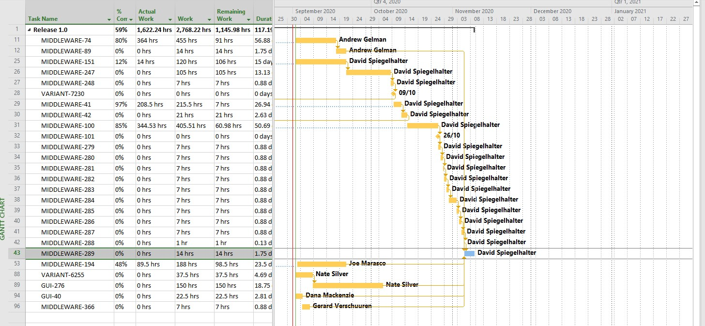

## Project Management

# Utilities

## Utility #1 Jira ticket hierarchy viewer - radial view

## Utility #2 Jira ticket hierarchy viewer - flat view

## Utility #3 Jira completion date forecast
 

## Utility #4 Jira live export to MS Project

## Utility #5 MS Project critical path analysis

## Utility #6 Jira allocation by team

## Utility #7 Jira historic effort distribution

## Utility #8 Jira historic effort distribution by team

## Utility #9 Monte Carlo Simulation of effort distribution

# Process 001
## Diagram #10 Product Lifecycle

# Hardware 001
## Diagram #11 Welding Robot #1

## Diagram #12 Belt Slitting Machine

## Diagram #13 Welding Robot #2

## Diagram #14 Control Panel#1

## Diagram #15 Encoders

## Diagram #16 ServoMotorBeltDrive

